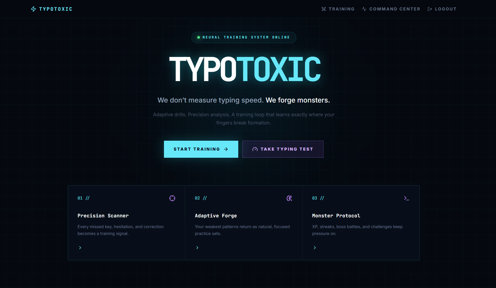
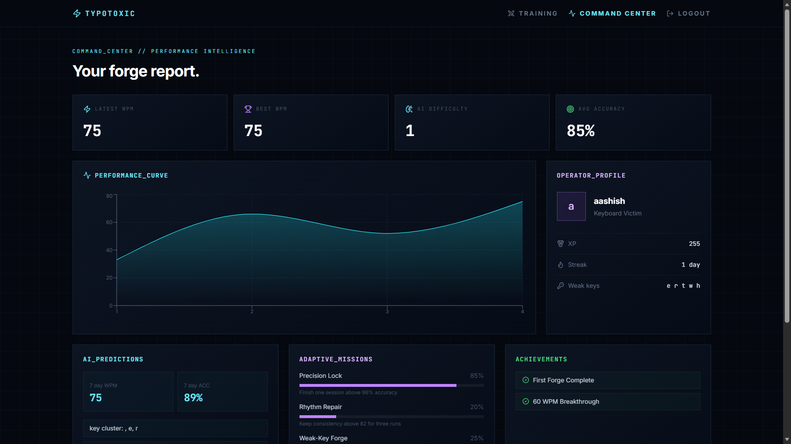

<!-- safepush-hero:start -->
<p align="center">
  
</p>
<!-- safepush-hero:end -->

<!-- safepush-images:start -->
## Preview

<p align="center">
  
</p>

<p align="center">
  
</p>

<p align="center">
  
</p>

<p align="center">
  
</p>

<!-- safepush-images:end -->

<div align="center">

# ⚡ TypoToxic

### **We don't measure typing speed. We forge monsters.**

A next-generation **AI-powered adaptive typing trainer** featuring real-time analytics, intelligent coaching, cyberpunk-inspired UI, personalized learning, and full-stack architecture.

<p>


</p>

---

### 🚀 Forge Speed. Build Accuracy. Train Intelligence.

</div>

---

# 📸 Preview

> Add screenshots here
```

assets/

dashboard.png

typing.png

analytics.png

ai-coach.png

leaderboard.png
```

---

# ✨ Features

## 🎯 Adaptive Typing Engine

- Dynamic difficulty adjustment
- AI-powered session recommendations
- Personalized typing paths
- Progressive learning system

---

## 🤖 AI Coach

The integrated AI Coach analyzes:

- Typing rhythm
- Hesitation patterns
- Weak words
- Weak keys
- Capitalization mistakes
- Punctuation mistakes
- Burst speed
- Fatigue level
- Accuracy trend
- WPM trend

If no AI provider is configured, TypoToxic automatically switches to an intelligent local fallback.

---

## 📊 Performance Analytics

Track everything that matters.

✔ Words Per Minute

✔ Accuracy

✔ Streak

✔ XP

✔ Skill Score

✔ Fatigue Risk

✔ Plateau Risk

✔ Session History

✔ Weak Characters

✔ Weak Words

✔ Progress Charts

---

## 🎮 Game Modes

- 🟢 Everyday
- 📖 Story
- ⚔ Challenge
- 💻 Code

---

## 🧠 Adaptive Intelligence

Each user receives a persistent learning profile including:

- Skill Score
- Learning Progress
- Difficulty Recommendation
- Target WPM
- Target Accuracy
- Daily Missions
- Weak Areas
- Achievements

---

# 🏗 Tech Stack

| Frontend | Backend | Database | AI |
|-----------|----------|----------|----|
| React | Node.js | MongoDB | Adaptive AI |
| Vite | Express | Mongoose | OpenRouter Compatible |
| JWT | REST API | Memory DB | Local AI Fallback |

---

# 📂 Project Structure

```text
TypoToxic/

backend/
frontend/
docs/
assets/
README.md
```

---

# ⚙ Installation

## Backend

```bash
cd backend
cp .env.example .env
npm install
npm run dev
```

## Frontend

```bash
cd frontend
cp .env.example .env
npm install
npm run dev
```

Open

```
http://localhost:5173
```

---

# 🔐 Environment Variables

## Backend

```env
PORT=5000

MONGO_URI=<YOUR_MONGODB_URI>

JWT_SECRET=<YOUR_JWT_SECRET>

CLIENT_URL=http://localhost:5173

USE_MEMORY_DB=true

AI_PROVIDER=<optional>

AI_API_KEY=<YOUR_AI_API_KEY>

AI_BASE_URL=<YOUR_AI_PROVIDER_ENDPOINT>

AI_MODEL=<YOUR_MODEL_NAME>
```

## Frontend

```env
VITE_API_URL=http://localhost:5000/api
```

> ⚠ Never commit your `.env` file or real API keys to GitHub.

---

# 🌐 REST API

## Authentication

```
POST /api/auth/register

POST /api/auth/login

GET /api/auth/me
```

---

## Results

```
POST /api/results

GET /api/results/me

GET /api/results/stats
```

---

## Challenges

```
POST /api/challenges

GET /api/challenges/me
```

---

## AI

```
GET /api/ai/profile

GET /api/ai/session

POST /api/ai/coach
```

---

# 🛡 Security

- JWT Authentication
- Protected Routes
- Password Hashing
- Secure Environment Variables
- API Key Isolation
- CORS Protection
- Input Validation

---

# 🚀 Roadmap

- Voice Typing
- Multiplayer Racing
- AI Challenge Generator
- Keyboard Heatmap
- Leaderboards
- Achievements
- Typing Tournaments
- ML-Based Prediction Model
- Mobile App

---

# ❤️ Contributing

Contributions are always welcome!

1. Fork the repository
2. Create a feature branch
3. Commit your changes
4. Open a Pull Request

---


<div align="center">

### ⭐ If you like this project, consider giving it a star!

Made with ❤️ by **TypoToxic**

</div>

## Usage

Add the main commands or workflow for this project.

## Safety

Keep secrets in local `.env` files and commit only safe examples.

<!-- safepush-tree:start -->
## Project Tree

```text
TypoToxic/
.gitignore
assests/
  feedback4.png
  main1.png
  result3.png
  test2.png
backend/
  .env.example
  package-lock.json
  package.json
  src/
    config/
    controllers/
    middleware/
    models/
    routes/
    server.js
    services/
    utils/
CHANGELOG.md
docs/
  assets/
    feedback4.png
    main1.png
    result3.png
    test2.png
frontend/
  .env.example
  index.html
  package-lock.json
  package.json
  postcss.config.js
  src/
    App.jsx
    components/
    context/
    data/
    index.css
    main.jsx
    pages/
    utils/
  tailwind.config.js
  vite.config.js
package-lock.json
README.md
```
<!-- safepush-tree:end -->


