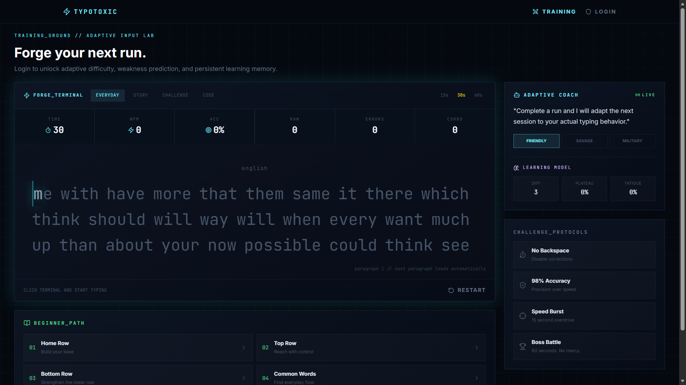
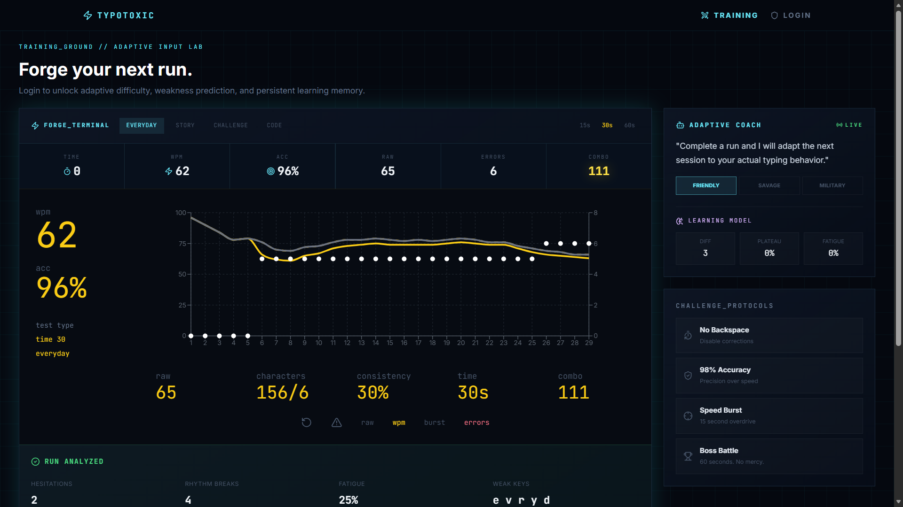
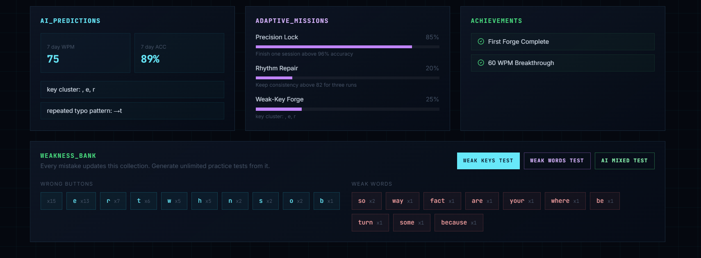

<!-- safepush-images:start -->
## Preview

<p align="center">
  
</p>

<p align="center">
  
</p>

<p align="center">
  
</p>

<p align="center">
  
</p>

<p align="center">
  
</p>

<!-- safepush-images:end -->

<!-- safepush-hero:start -->
<p align="center">
  
</p>
<!-- safepush-hero:end -->


<div align="center">

## Install

Add installation steps for this project.

## Usage

Add the main commands or workflow for this project.

## Test

Add the test command for this project.

## Safety

Keep secrets in local `.env` files and commit only safe examples.

<!-- safepush-tree:start -->
## Project Tree

```text
TypoToxic/
.gitignore
assests/
  img1.png
  img2.png
  img3.png
  img4.png
  img5.png
backend/
  .env.example
  package-lock.json
  package.json
  src/
    config/
    controllers/
    middleware/
    models/
    routes/
    server.js
    services/
    utils/
CHANGELOG.md
docs/
  assets/
    feedback4.png
    img1-2.png
    img1-3.png
    img1-4.png
    img1-5.png
    img1-6.png
    img1.png
    img2-2.png
    img2-3.png
    img2-4.png
    img2-5.png
    img2-6.png
    img2.png
    img3-2.png
    img3-3.png
    img3-4.png
    img3-5.png
    img3-6.png
    img3.png
    img4-2.png
    img4-3.png
    img4-4.png
    img4-5.png
    img4-6.png
    img4.png
    img5-2.png
    img5-3.png
    img5-4.png
    img5.png
    main1.png
    result3.png
    test2.png
frontend/
  .env.example
  index.html
  package-lock.json
  package.json
  postcss.config.js
  src/
    App.jsx
    components/
    context/
    data/
    index.css
    main.jsx
    pages/
    utils/
  tailwind.config.js
  vite.config.js
package-lock.json
README.md
```
<!-- safepush-tree:end -->


